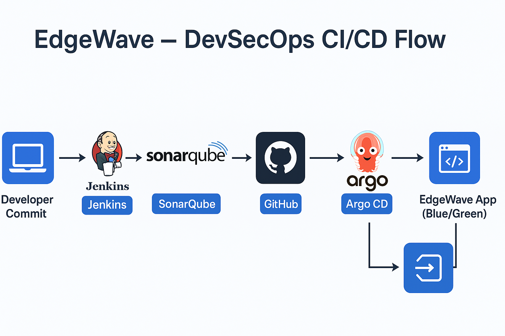

# 🧠 EdgeWave — DevSecOps CI/CD Project (Full GitOps Flow)

---

## ⚙️ Overview

**EdgeWave** implements a complete DevSecOps lifecycle — from **code commit to auto-deployment on AWS EKS** using **Argo CD (GitOps)**.

| Tool           | Role                                 |
| -------------- | ------------------------------------ |
| **Jenkins**    | CI + GitOps trigger                  |
| **SonarQube**  | Static code quality scan             |
| **Docker Hub** | Container image registry             |
| **GitHub**     | Source of truth for code & manifests |
| **Argo CD**    | Continuous Delivery (auto-sync)      |
| **EKS**        | Kubernetes production environment    |

---



---

## 🔐 Jenkins ↔ GitHub Integration Setup

To make Jenkins automatically pull code and push manifest updates via SSH, configure it once as follows:

### 1. Generate SSH Key for Jenkins

```bash
sudo su - jenkins
ssh-keygen -t ed25519 -C "jenkins@edgewave"
cat ~/.ssh/id_ed25519.pub
```

Copy the public key output.

---

### 2. Add Jenkins SSH Key to GitHub

In your GitHub account:

* Go to **Settings → SSH and GPG keys → New SSH key**
* Title: `Jenkins CI Key`
* Paste the public key
* Save

---

### 3. Add GitHub SSH Credentials in Jenkins

In Jenkins → **Dashboard → Manage Jenkins → Credentials → Global → Add Credentials**

| Field       | Value                                                |
| ----------- | ---------------------------------------------------- |
| Kind        | SSH Username with private key                        |
| ID          | `github-ssh`                                         |
| Username    | `git`                                                |
| Private Key | Paste contents of `/var/lib/jenkins/.ssh/id_ed25519` |

---

### 4. Configure Jenkins Pipeline Job

**Definition**: *Pipeline script from SCM*

| Field            | Value                                     |
| ---------------- | ----------------------------------------- |
| SCM              | Git                                       |
| Repository URL   | `git@github.com:gauravchile/EdgeWave.git` |
| Credentials      | `github-ssh`                              |
| Branch Specifier | `*/main`                                  |
| Script Path      | `Jenkinsfile`                             |

---

### 5. Auto-Build Trigger (PollSCM)

In your Jenkinsfile:

```groovy
triggers {
  pollSCM('H/1 * * * *') // Poll GitHub every 1 minute
}
```

Now Jenkins checks GitHub every minute for new commits and auto-triggers builds.

---

## 🧱 Jenkins CI/CD Pipeline Flow

1. Checkout from GitHub via SSH
2. Run SonarQube static code scan
3. Enforce Quality Gate before build
4. Build Docker images for backend/frontend
5. Push to Docker Hub (`gauravchile/edgewave`)
6. Update image tags in K8s manifests
7. Commit and push updated manifests to GitHub
8. Argo CD auto-syncs & deploys new version to EKS

---

## 🛠️ Makefile Commands (End-to-End Automation)

### ⚙️ Environment Setup

```bash
make prequs               # Install dependencies
make cluster-bootstrap     # Bootstrap EKS cluster and ArgoCD
```

### 🛠️ Local Tools

```bash
make sonarqube-up          # Launch SonarQube locally via Docker
make argocd-port           # Forward ArgoCD dashboard to localhost:8080
```

### 🛠️ Docker Build & Push

```bash
make build-frontend        # Build frontend image
make build-backend         # Build backend image
make push-frontend         # Push frontend to Docker Hub
make push-backend          # Push backend to Docker Hub
make build-push-all        # Build & push both images
```

### 🔄 Kubernetes Deployment

```bash
make deploy                # Apply manifests to EKS
make remove                # Delete EdgeWave namespace
```

### 🔄 GitOps Utilities

```bash
make update-kustomize      # Update manifests & push changes (GitOps trigger)
```

### 🔄 Blue/Green Deployment

```bash
make switch-blue           # Switch traffic to Blue deployment
make switch-green          # Switch traffic to Green deployment
```

### 🚀 Full Production Deployment

```bash
make deploy-prod COLOR=blue VERSION=v1.0.0
```

➡️ Builds images, pushes to Docker Hub, updates manifests, and triggers Argo CD sync automatically.

### 🔍 Verify ALB Health

```bash
make verify-alb
```

Checks target group health and ensures live version is serving traffic.

### 🛩 Cleanup

```bash
make clean
```

Removes unused Docker containers, images, and volumes.

---

## 🛃️ Verify End-to-End Flow

1. Commit to GitHub → Jenkins auto-triggers via PollSCM
2. Jenkins builds, scans, pushes, and updates manifests
3. Argo CD detects change → auto-syncs to EKS
4. Verify running pods:

```bash
kubectl -n edgewave get pods -o wide
```

5. Access frontend via LoadBalancer:

```bash
kubectl -n edgewave get svc edgewave-frontend -o wide
```

Open the `EXTERNAL-IP` in your browser to confirm the deployed color-coded environment.

---

## 💳 Jenkins Credentials Summary

| ID                | Type                | Purpose               |
| ----------------- | ------------------- | --------------------- |
| `github-ssh`      | SSH Key             | GitHub clone/push     |
| `dockerhub-creds` | Username & Password | Docker Hub push       |
| `sonar-token`     | Secret Text         | SonarQube integration |

---

## ✅ Summary

| Stage  | Tool                | Description             |
| ------ | ------------------- | ----------------------- |
| CI     | Jenkins + SonarQube | Build, scan, and push   |
| GitOps | GitHub              | Source of truth         |
| CD     | Argo CD             | Auto-sync to EKS        |
| Deploy | EKS                 | Run app with Blue/Green |

🌟 **EdgeWave** is now a fully automated **DevSecOps + GitOps** platform that builds, scans, and deploys directly to production — with a single commit.
